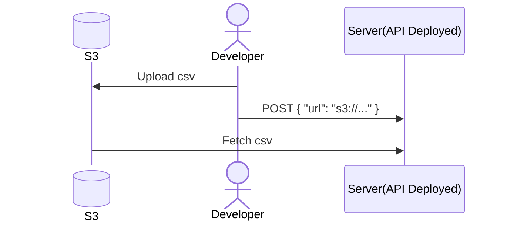
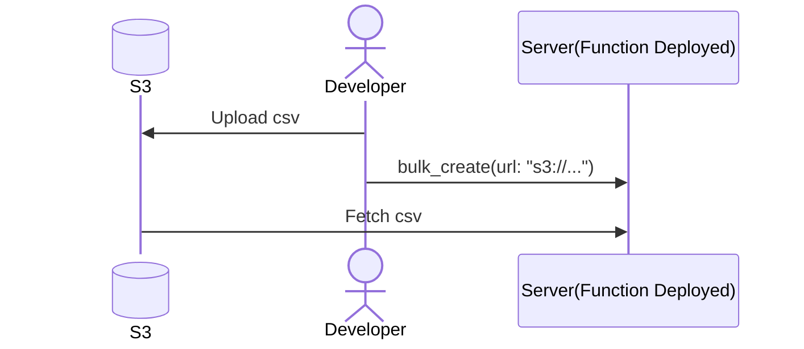
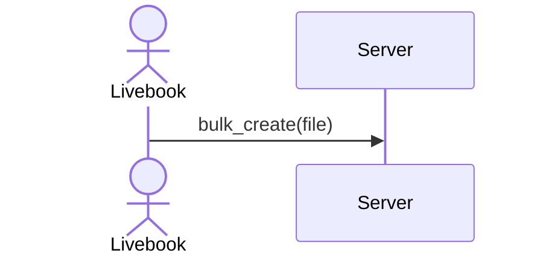

# Elixir만 가능한  실서버 운영 맛보기

김민섭

<!--
발표셋업

내 화면
* presenter

발표화면
* slides
* plato app
* bulk create notebook with attached node
* deployed livebook
* bulk create admin notebook
* finder with csv files
-->

<!--
안녕하세요, Elixir만 가능한 실서버 운영 맛보기라는 제목으로 발표를 하게 된 발표자 김민섭입니다.\
우리는 대 어그로의 시대를 살아가고 있죠. 넘쳐나는 쇼츠, 하루가 멀다하고 나오는 새로운 AI 툴들.\
거기다 항상 곧 AGI를 달성하겠다는 샘 알트먼까지.\
저도 이러한 세태에서 살아남기 위해 제목으로 어그로를 좀 끌어봤습니다.\
여러분들을 이 자리에 이끄는 것으로 제목은 소명을 다했으니 이건 이제 수정하고 발표를 계속하도록 하죠.
-->

---
layout: cover
---

# ~~Elixir만 가능한~~  Elixir와 Livebook으로 달라지는  실서버 운영 맛보기

김민섭

<!--
Elixir와 Livebook으로 달라지는 실서버 운영 맛보기.\
김이 좀 새셨나요? 사실 튜링완전이라는 관점에서는 Elixir만 가능한게 있을리가 없죠.\
하지만 Livebook을 안 써보신 분들에게는 아주 뻔한 이야기는 아닐겁니다.\
제가 아는 한, 퍼스트 파티에서 제공하는, 이 정도로 걸출한 인터랙티브 노트북 어플리케이션은 없거든요.
-->

---
layout: image-right
image: ./images/livebook.png
backgroundSize: contain
---

# Livebook
* Elixir를 위한 인터랙티브 노트북
* Python JupyterLab, Google Colab, Julia Pluto.jl 등
* 동시편집 가능
* 재현가능성
* https://livebook.dev/

<!--
Livebook을 모르시는 분들을 위해 간단히 소개는 해야겠죠.\
Livebook은 Elixir를 위한 인터랙티브 노트북입니다.\
많이들 써보셨을 JupyterLab과 비슷한 제품입니다.\
재현가능성과 동시편집 기능이 다른 노트북 어플리케이션과의 차별점이라 보시면 됩니다.
-->

---
layout: statement
---

# 실서버 운영?

<!--
Livebook이 뭔지 알아봤으니 다음으로 실서버 운영에 대해 이야기해보죠.\
실서버 운영이라고 제가 모호하게 제목을 정했는데 다들 어떤걸 기대하고 오셨나요?\
(버그 핫픽스, 서버 모니터링, DB 마이그레이션...)
-->

---
layout: fact
---

# 고객 요청 대응

<!--
제가 이번 발표에서 보여드리려는 것은 고객 요청 대응 워크플로우입니다.\
기민하게, UI 개발 없이요.\
제품 개발 초기에는 다들 이런 작업을 종종 하실겁니다.
-->

---
layout: center
---

# **제약사항** 
* B2B SaaS를 제공하는 소규모 회사
* 문제은행 관리 솔루션
* 제품 개발 초기 단계
* **<u>디자인 능력 부족</u>** 한 개발자
* ~~디자이너~~ 
* ~~전담 CS 인력~~ 
* ~~어드민 페이지~~ 

<!--
자, 이제 다같이 상상해봅시다.\
여기는 B2B SaaS를 제공하는 소규모 회사입니다.\
제품은 학원을 대상으로 영업하는 문제은행 관리 솔루션으로, 개발은 아직 초기 단계이구요.\
그리고, 우리는 디자인 능력이 부족한 개발자입니다.\
회사에는 디자이너도 전담 CS 인력도, 별도의 어드민 페이지도 없습니다.
-->

---
layout: statement
---

# 요청사항

## 학생 및 문제은행 데이터 마이그레이션

<!--
한창 기능개발으로 바쁜 와중에 새로운 고객의 요청이 들어옵니다.\
"저희는 기존에 엑셀로 원생들과 문제은행을 관리하고 있는데요.\
원생은 200여명에 주변 학교 기출문제를 10년 정도 쌓다보니 문제 수도 5000개 정도 됩니다.\
이거 수동으로 입력하기는 너무 힘든데 방법이 없을까요?"
-->

---
layout: statement
---

# 이상

## csv파일 업로드 기능 개발

<!--
이상적인 방법은 csv파일 업로드 기능을 개발하는 것이겠죠.\
고객도 매번 번거롭게 우리에게 연락을 할 필요도 없고, 우리도 일일이 대응을 하지 않아도 됩니다.
-->

---
layout: statement
---

# 현실

## UI개발, 예외 처리 너무 복잡해...😭

<!--
하지만 csv파일 업로드 기능을 위해 UI를 개발하는 데에는 시간이 많이 소요됩니다.\
실패 시 수백줄의 csv 중 어느부분이 어떻게 틀렸는지 적절하게 피드백을 주는 것은 복잡하죠.\
이걸 개발한다고 하면 우리는 코어 기능개발은 멈추고 많은 시간을 쓰게 될거구요.\
그동안 고객은 우리 제품에 관심이 식을수도 있고, 경쟁사의 제품을 발견할 지도 모릅니다.
-->

---
layout: statement
---

# 타협

## csv파일을 처리하는 로직만 만들어서 직접 처리

<!--
그래서 이메일로 csv파일을 받아 직접 처리하기로 합니다.\
대량 생성 로직만 잘 만들어두면 어찌저찌 처리할 수 있을 겁니다.\
이 작업이 어떻게 진행될 지 몇 가지 시나리오를 한 번 보도록 하죠.\
혹시 더 나은 시나리오가 있다면, 제가 상상력이 부족한 탓이니 알려주시면 감사하겠습니다.
-->

---
layout: center
---

# **방법 1: Interactive Shell이 없는 경우** 
1. 대량 생성 로직을 개발
2. 해당 로직을 API로 노출
3. 배포
4. csv파일을 S3에 업로드
5. presigned URL을 파라미터로 API 호출

 

<!--
대화형 쉘이 없는 경우는 다음과 같은 방식으로 처리하게 될겁니다.\
실패 처리가 제대로 되지 않은 대량 생성 로직과 API 정도를 개발해서 배포하겠죠.\
고객에게 받은 csv파일은 S3에 업로드 하고요.\
API에 파라미터로 업로드한 파일의 presigned url을 넘겨주면, 서버가 대량 생성 작업을 수행하게될겁니다.
-->

---
layout: center
---

# **방법 2: Interactive Shell이 있는 경우** 
1. 대량 생성 로직을 개발
2. 배포
3. csv파일을 S3에 업로드
4. 원격서버에 접속해서 콘솔 실행 후 presigned URL을 사용해 대량 생성 로직 실행

 
 

<!--
대화형 쉘이 있는 경우는 좀 낫습니다.\
따로 API를 노출하지 않아도 원격 접속하여 쉘을 통해 로직을 실행할 수 있습니다.\
이 경우에도 여전히 배포를 해야하고, S3에 업로드를 해야합니다.
-->

---
layout: center
---

# **그 외 다른 방법들** 
* 원격서버에 접속해 배포없이 기존 함수 사용하여 한땀한땀 생성 작업 수행
* 로컬 서버와 프로덕션 DB를 연결하여 배포없이 작업 수행
* DB 클라이언트로 프로덕션 DB에 접속하여 SQL 쿼리로 작업 수행
* sftp, rsync 등의 툴로 원격 서버에 직접 csv 파일 전송
* ...

<!--
앞의 두 가지 방법이 제가 생각하는 보편적인 방법입니다.\
그 외에도 무궁무진한 방법이 있겠죠.\
하지만 다들 썩 하고싶은 방법은 아닐겁니다.\
적어도 저는 이렇게 작업을 하고싶지는 않네요.
-->

---
layout: center
---

# **방법 3: Elixir + Livebook의 경우** 
1. Livebook에 파일 드래그 앤 드롭
2. Livebook으로 대량 생성 로직 노트북 파일 작성
3. Livebook으로 원격서버에 접속해서 코드 실행

 

<!--
이제 Elixir와 Livebook을 사용하면 어떻게 달라지는 지 보겠습니다.\
Livebook을 실행하고 attached node기능을 사용하여 실서버에 접속하여 코드를 실행하기만 하면 됩니다.\
훨씬 간단해졌죠? 이제 배포도 없고 별도의 파일 전송도 없습니다.\
이 과정에 대한 시연을 지금부터 시작하겠습니다.\
(Livebook을 이용한 대량생성 시연)\
너무 간단해서 이게 뭐야 하실거라 강조하자면, \
지금 우리는 별도의 파일전송 고민 없이 로컬에 있는 csv파일을 다루는 원격 서버 코드 실행의 시연을 보신겁니다.
-->

---
layout: statement
---

# ~~배포~~ 

<!--
정리하겠습니다.\
Livebook을 사용하면 우리는 이제 배포도 안해도 되고, 
-->

---
layout: statement
---

# ~~S3 파일 업로드~~ 

<!--
원격 서버로 파일을 어떻게 전송할 지 고민하지 않아도 됩니다.
-->

---
layout: statement
---

# ~~로컬에서 프로덕션 DB 접속~~ 

<!--
그러면서 로컬에서 프로덕션 DB에 직접 붙는 무서운일도 하지 않을 수 있죠.
-->

---
layout: statement
---

# 노트북 파일 공유

<!--
그리고 노트북 파일을 깃 저장소에 추가하면 어플리케이션에 로직을 추가하지도 않으면서, \
동료들이 같은 작업을 똑같이 대신 수행해 줄 수도 있습니다.
-->

---
layout: statement
---

# **Bonus** 

---
layout: image-right
image: ./images/livebook_teams.png
backgroundSize: contain
---

# Livebook Teams
* Notebook을 사내 툴로 배포해주는 서비스

---
layout: image-right
image: ./images/tidewave.png
backgroundSize: contain
---

# Tidewave
* 웹서버 로그, DB, 브라우저와 통합된 코딩 에이전트

---
layout: image
image: ./images/tidewave_css.png
backgroundSize: contain
---

---
layout: statement
---

# Elixir와 Livebook으로 달라지는  실서버 운영 맛보기   끝!

<!--
혹시 회사에서 Elixir를 사용하지 않는 분들은 사이드 프로젝트로라도 Livebook을 꼭 한번 경험해보시길 추천합니다.\
지금까지 Elixir와 Livebook으로 달라지는 실서버 운영 맛보기 발표를 들어주셔서 감사합니다.\
끝!
-->
